  

  
  

## 👋 About me

I'm a .NET engineer. I build with Blazor, ASP.NET MVC and Web APIs, and I care a lot about what happens when the traffic actually shows up: caching, background work, clean boundaries, and services that scale out instead of falling over.

For the last 2+ years most of my time has gone into AI products. Not a chat box glued onto an app. LLM agents, retrieval pipelines and integrations that live inside a real product and serve real users at scale.

Building something on .NET, or trying to get AI to behave in production? Let's talk.

## 🏗️ How I build

  

## 🛠️ Tech stack

<table align="center">
  <tr>
    <td align="right"><b>Languages</b></td>
    <td></td>
  </tr>
  <tr>
    <td align="right"><b>.NET</b></td>
    <td>
       
      
      
      
      
      
      
      
      
    </td>
  </tr>
  <tr>
    <td align="right"><b>AI</b></td>
    <td>
      
      
      
      
    </td>
  </tr>
  <tr>
    <td align="right"><b>Data</b></td>
    <td></td>
  </tr>
  <tr>
    <td align="right"><b>Frontend</b></td>
    <td></td>
  </tr>
  <tr>
    <td align="right"><b>Ship it</b></td>
    <td>
       
      
    </td>
  </tr>
  <tr>
    <td align="right"><b>Editors</b></td>
    <td></td>
  </tr>
</table>

## 📊 My year in 3D

  <picture>
    <source media="(prefers-color-scheme: dark)" srcset="https://raw.githubusercontent.com/Gotiap/Gotiap/output/3d/profile-night-rainbow.svg" />
    <source media="(prefers-color-scheme: light)" srcset="https://raw.githubusercontent.com/Gotiap/Gotiap/output/3d/profile-green-animate.svg" />
    
  </picture>

  <picture>
    <source media="(prefers-color-scheme: dark)" srcset="https://streak-stats.demolab.com?user=Gotiap&hide_border=true&background=0D1117&ring=39D353&fire=39D353&currStreakNum=39D353&sideNums=E6EDF3&currStreakLabel=E6EDF3&sideLabels=8B949E&dates=8B949E&stroke=30363D" />
    <source media="(prefers-color-scheme: light)" srcset="https://streak-stats.demolab.com?user=Gotiap&hide_border=true&background=FFFFFF&ring=2DA44E&fire=2DA44E&currStreakNum=1F883D&sideNums=1F2328&currStreakLabel=1F2328&sideLabels=59636E&dates=59636E&stroke=D0D7DE" />
    
  </picture>

## 🕹️ Arcade

  <picture>
    <source media="(prefers-color-scheme: dark)" srcset="https://raw.githubusercontent.com/Gotiap/Gotiap/output/game-dark.svg" />
    <source media="(prefers-color-scheme: light)" srcset="https://raw.githubusercontent.com/Gotiap/Gotiap/output/game.svg" />
    
  </picture>

  

